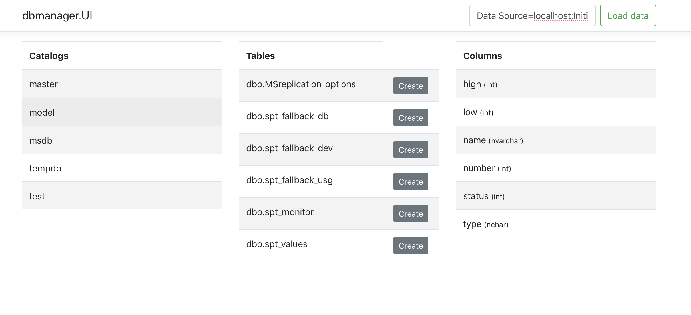
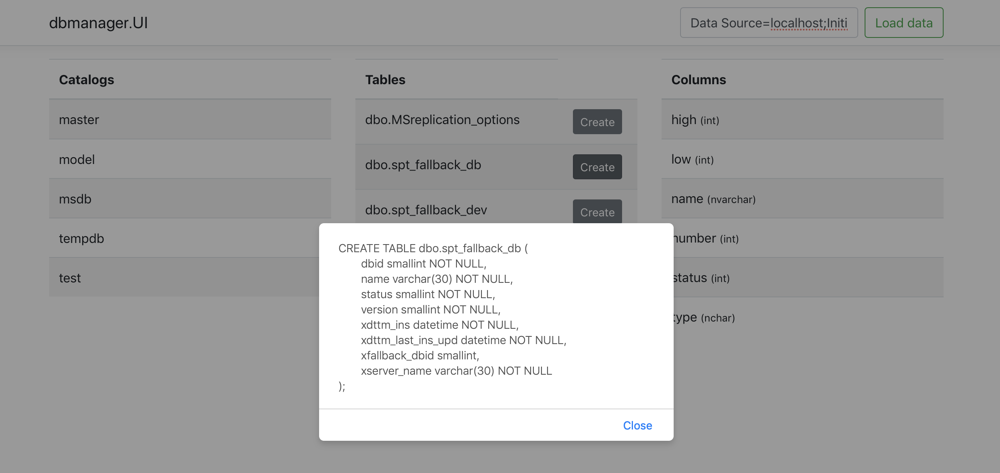

# dbmanager

## Summary

Simple Database Manager with .Net Core 3.1, React and Bootstrap.
Tested on docker container with mssql/server:2017-latest-ubuntu image.

## Examples

To connect with Sql Server DB instance, enter connection string and press "Load data".

For example, 'Data Source=localhost;Initial Catalog=master;User Id=USER;Password=PASSWORD'.

Base layout:

Press "Create" to show "create table" script:

