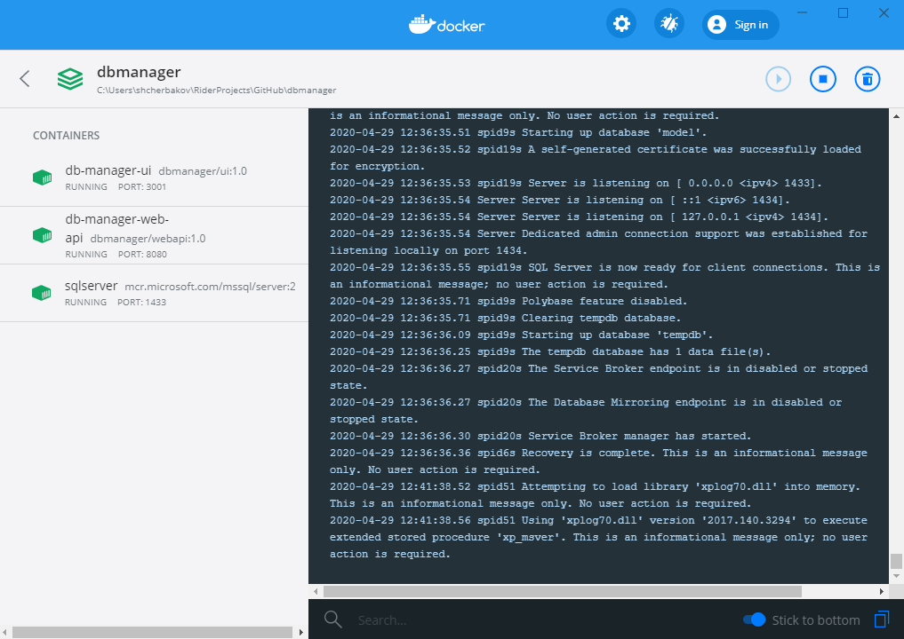
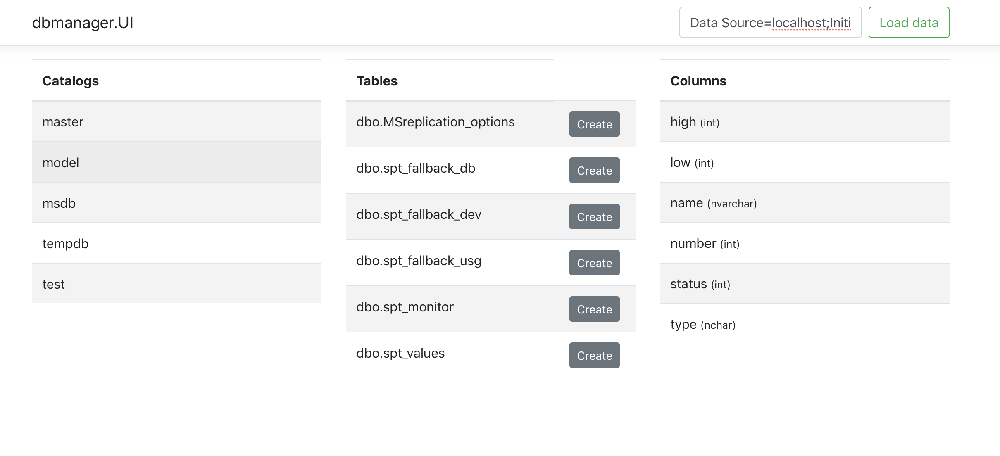
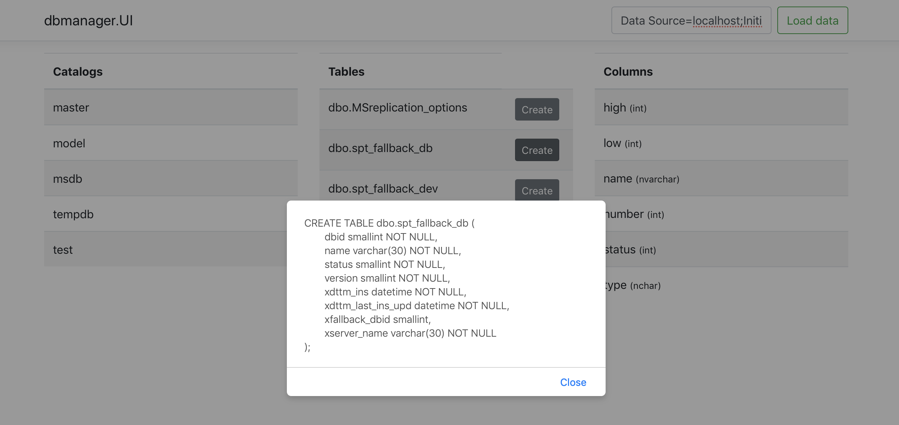

# Database Manager

## Summary

Simple Database Manager developed with AspNetCore 3.1, React and Bootstrap.

The main goal is to use fewer third-party nuget packages.

Features:

- Connect with any Sql Server instance
- Display db schema (catalogs, tables, columns)
- Generate create table script 

Solution designed with Onion architecture.

Tested on docker container with _mssql/server:2017-latest_ image.

## Build and Run

Docker compose consists of three containers:

- Sql Server
- WebApi
- React app

Use command line and change current directory to root solution folder, then run commands:

- to build and start containers: '**docker-compose up -d --build**'.
- to shut down containers: '**docker-compose stop**'.

Swagger for WebApi: [http://localhost:8080/](http://localhost:8080/).

React app: [http://localhost:3001/](http://localhost:3001/).

Sql server connection string: '**Data Source=sql-server;Initial Catalog=master;User Id=sa;Password=16F74A6C-F89D-4306-BD13-C972A86DE213**'.

## Examples

To connect with Sql Server DB instance enter connection string and press "Load data".

Click on any catalog to see it's tables.

Click on any table to see it's columns.

Press "Create" button on any table row to see _create table_ script.

Base layout:

Popup with create table script:

